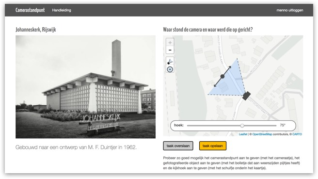

# Viewpoint Widget hetvolk.org

This widget is a frontend crowdsource-application on the [HetVolk.org](https://hetvolk.org/) API. The widget feeds you a photo from a chosen crowdsource project and lets you set the cameraposition, camera angle and the position of the object photographed.



This widget uses the [Leaflet.GeotagPhoto plugin](https://github.com/nypl-spacetime/Leaflet.GeotagPhoto) by the New York Public Library.


## Install the Widget

_Please note that the HetVolk.org backend-
 application and API are not open sourced (yet). If you would like to run a crowdsource project, please contact the people of HetVolk.org._

1. git clone this repository to a directory
1. In a terminal: move into your directory
1. Download Composer ```curl -sS https://getcomposer.org/installer | php```
1. And run php ```composer.phar install```
1. Point your virtual host document root to your new application's `public/` directory.
1. Ensure `logs/` is web writeable.

